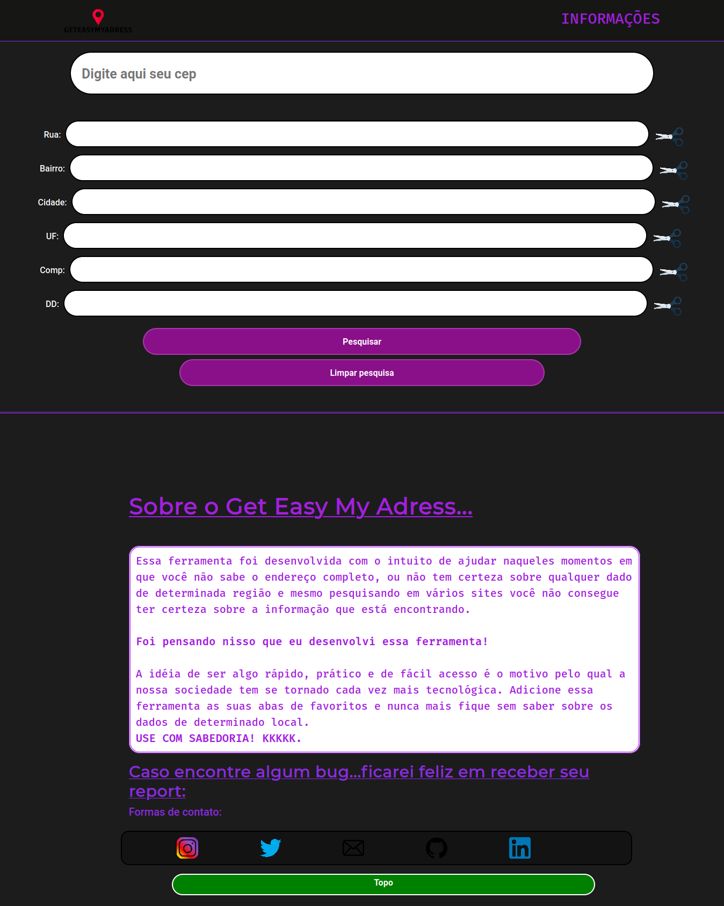
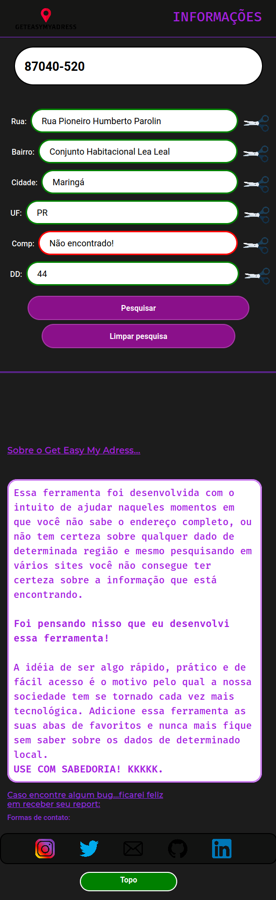
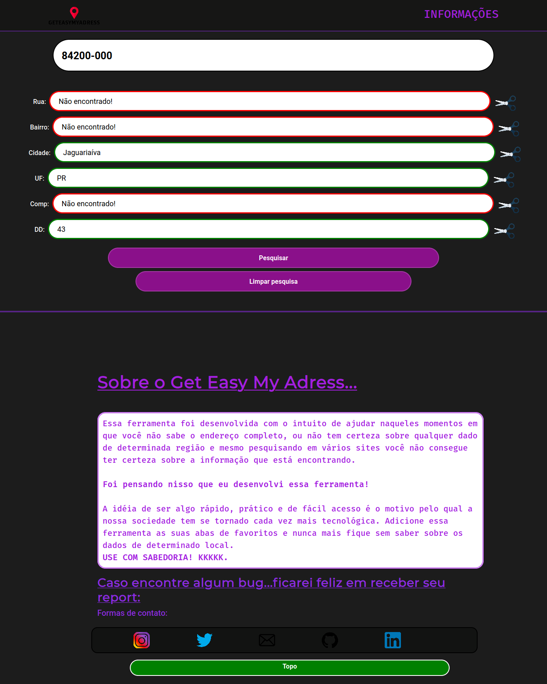
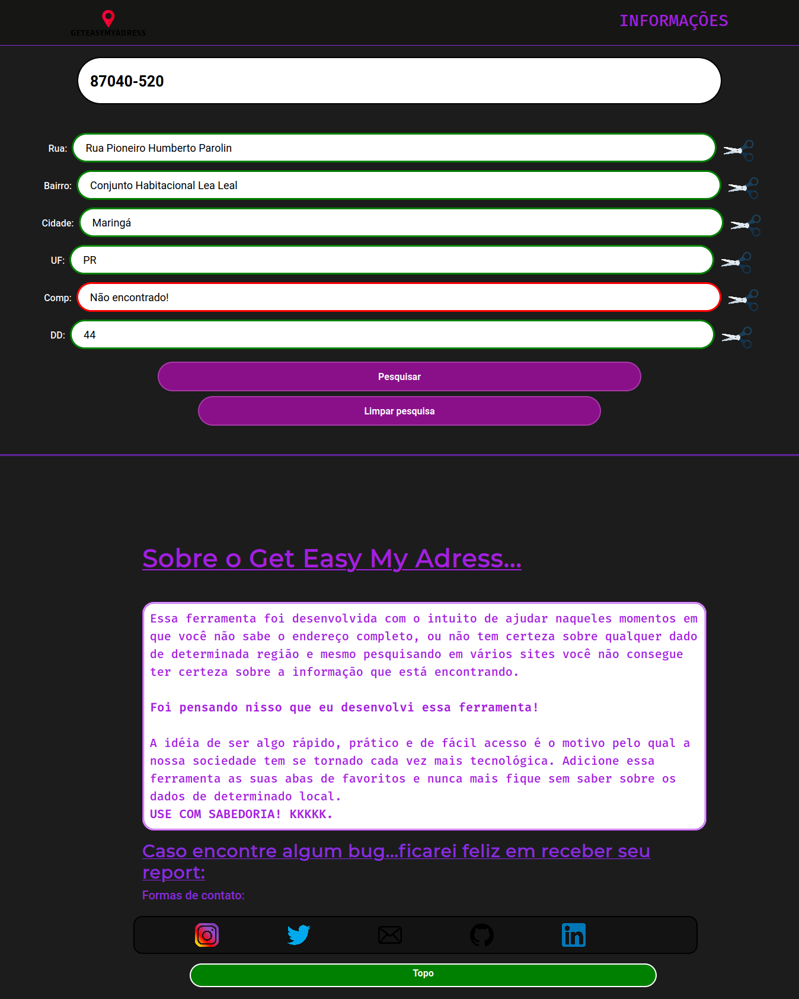

# GetEasyMYAdress 
## Econtre dados sobre um endereço de uma forma mais rápida e fácil com essa simples, porém incrível ferramenta.

<h3>Com ela você é capaz de encontrar de forma descomplicada dados que geralmente temos uma certa dificuldade em encontrar ou coisas que temos dificuldade em ter certeza quando alguem nos pergunta. Como: Nome de determinada rua, complemento, bairro, DD, entre outros.</h3>

<h3>Com uma interface simples, intuitiva e responsiva, que vai se adequar muito bem no seu dispositivo, independente de qual ele seja.Composta por uma Layout bonito, moderno e simples.</h3>
  
  
  
<h3>A ferramenta possui funcionalidades pensadas para otimizar sua busca, como: 
  recortar dado de um respectivo campo de forma rápida, apresentação de resultados ao efetuar a busca e um botão para limpar o campo de busca de forma rápida, sem que você tenha que ficar por muitas vezes apertando o 'BACKSPACE'</h3>
  
  <h4>Ela retorna feedbacks visuais de acordo com os dados disponíveis sobre o local que você pesquisou.</h4>
  
  
  
  
  

**Linguagens e Frameworks usados: Vannila Javascript, CSS3, HTML5, Bootstrap, API do ViaCep**

**Novas Features adicionadas: Agora pode ser pressionado as teclas: "Enter" para poder fazer a pesquisa e "q" para poder limpar os campos.**
Caso tenha alguma idéia de feature que possa ser disponibilizada na ferramenta, ou até mesmo uma correção ou feedback sobre ela. Pode entrar em contato pelos links disponibilizados na própria ferramenta.
